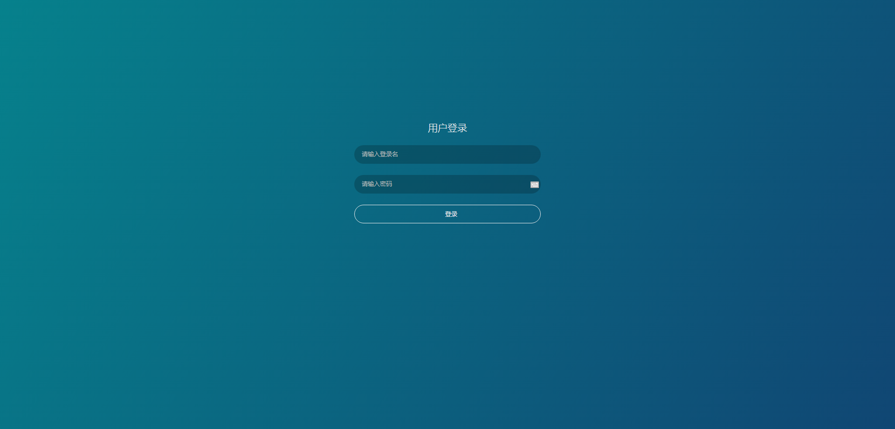
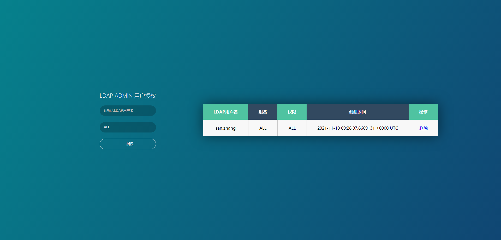

## mega-ldap-proxy


[](https://hub.docker.com/r/feiyu563/mega-ldap-proxy)

[](https://github.com/feiyu563/mega-ldap-proxy/releases)

[]()
[]()

-----------------

mega-ldap-proxy是开源的支持ldap认证的反向代理，目前已经实现基本的权限控制，可用于帮助一般没有任何授权即可访问的系统（如prometheus、alertmanager、OpenGrok等），使用mega-ldap-proxy，可以实现让这些系统支持ldap认证，并可以实现简单的权限控制。





--------------------------------------

* 如果这个项目能为您带来帮助，我将感到非常荣幸！

* mega-ldap-proxy的成长离不开所有爱好运维和开发的朋友们的支持！如果您也对这个项目感兴趣，请点击一下 Star 以示鼓励，谢谢

<br>
<br>

## 启动

```
#打开mega-ldap-proxy releases页面，根据需要选择需要的版本下载到本地解压并进入解压后的目录
如linux版本(https://github.com/feiyu563/mega-ldap-proxy/releases/download/v1.0.0/linux.zip)

# wget https://github.com/feiyu563/mega-ldap-proxy/releases/download/v1.0.0/linux.zip && unzip linux.zip &&cd linux/

#运行mega-ldap-proxy
# ./mega-ldap-proxy (#后台运行请执行 nohup ./mega-ldap-proxy &)

#启动后可使用浏览器打开以下地址查看：http://127.0.0.1

```

PS: 如果需要采用mysql作为mega-ldap-proxy的数据库，则需要提前创建数据库和访问帐号等

```
创建mysql数据库和帐号

CREATE DATABASE mega_ldap_proxy CHARACTER SET utf8mb4 COLLATE utf8mb4_general_ci;

GRANT SELECT,INSERT,UPDATE,DELETE,CREATE,DROP,ALTER ON `mega_ldap_proxy`.* TO 'mega_ldap_proxy'@'%' IDENTIFIED BY 'xxxxxx';

flush privileges;
```
<br>
<br>

-----------------
## 基本配置信息
```
[INIT]
port=80
#格式 协议://IP:端口,目前不支持路径
backend_url=https://www.baidu.com:8383
#管理员用户名，支持多个，用,隔开
adminuser=san.zhang,wu.wang
#是否前台输出file or console
logtype=file
#日志文件路径
logpath=logs/mega_ldap_proxy.log
#支持sqlite3、mysql、postgresql
db_driver=qlite3
#如果使用的db_driver是mysql或者postgresql，请取消下面的注释，配置你的实际参数
# db_user=mega_ldap_proxy
# db_password=123456
# db_host=127.0.0.1
# db_port=3306
# db_name=mega_ldap_proxy
[LDAP]
#LDAP地址
ldap_url=myldap.com
ldap_port=389
ldap_login=cn=xxx,ou=xxx,dc=myldap,dc=com
ldap_password=1123456
ldap_basedn=ou=xxx,dc=myldap,dc=com
```

-----------------